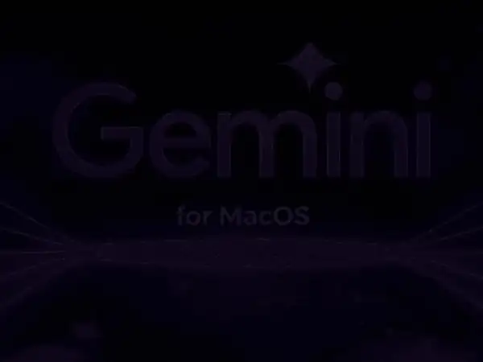

# Gemini Studio for macOS

*Or: A Certain Fruit Company Took a Year, We Took a Coffee Break*

**DOCUMENT CLASSIFICATION:** README / OBITUARY FOR PRODUCTIVITY
**DATE RECORDED:** Sometime After We Got Impatient
**LOCATION:** Here at Floyd's Labs (which is not a boardroom)
**BEVERAGE:** Coffee that definitely shouldn't be this effective
**CURRENT STATE:** Done. Which is the whole point.

---

## What This Is (Or: The Thing That Exists Now)

This is Gemini Studio for macOS.

It runs locally. It respects your machine. It does everything you actually wanted from the web version—without asking permission, phoning home every five seconds, or pretending latency is a feature.

It is fast, self-contained, and very real.

Which is already more than we can say for a lot of "coming soon" pages designed in very expensive offices.

---

## A Brief Moment of Silence (Or: The Year That Disappeared)

Let's acknowledge what came before.

A very large, very polished, very fruit-adjacent organization spent over a year heading toward something like this.

A full calendar year.

Three hundred and sixty-five days of:

- Stand-ups that stood still
- Alignment meetings about future alignment meetings
- Slack threads multiplying like rabbits and read by no one
- Jira tickets aging into archaeological artifacts

Entire teams. Real budgets. Immaculate slides.

Meanwhile, here at Floyd's Labs, Douglas looked at the same problem, took a sip of coffee that tastes like it might void a warranty, and said—while half asleep—

> "just do the thing."

Then promptly disappeared for a nap.

So we did.

Roughly thirty minutes later, this existed.

This document serves as a small, respectful gravestone for that lost year—now compressed into a cautionary tale about what happens when process becomes the product.

No roadmap theater. No "let's circle back." No twelve-step approval rituals.

Just: build the thing, run it locally, move on.

Generative velocity does not wait for permission slips.

---

## Quick Start (Or: You Could Already Be Using This)

1. Install dependencies: `npm install`
2. Add your API key to `.env`: `GEMINI_API_KEY=your_key_here`
3. Start it: `npm run dev`
4. Open the local URL (usually `http://localhost:13000`)

That's it. No onboarding flow. No "getting started experience." No guided tour hosted by a smiling tooltip.

---

## What It Actually Does (Or: The Useful Part Without the Marketing Voice)

### Core Workspace

- Persistent chat with real memory (yes, still rare somehow)
- Thread management that doesn't fight you
- Canvas workspace for editing, building, and actually using outputs
- Light/Dark mode because we're not monsters

### Local Intelligence (MCP)

- Custom agents ("Gems") that do what you tell them
- Personal memory that sticks
- Scheduled tasks without needing a SaaS subscription
- Artifact library for everything you've made

### Multimodal Tools

- Text-to-speech that just works
- Music generation (yes, really)
- Video generation for when text isn't enough
- Live hooks for camera/screen because why not

### Integrations

- Google ecosystem hooks (Docs, Drive, etc.)
- Shareable links without turning your data into a product

---

## The Part We Didn't Expect (Or: Where It Got Interesting)

Originally, the multimodal stuff lived in chat.

Which is fine. Also boring.

Then we realized something obvious in hindsight:

**The Canvas is the product.**

So we wired everything into it.

Now you can:

- Rewrite directly where you're working
- Turn text into audio without exporting anything
- Generate code and immediately use it
- Create media that doesn't leave the workspace

The result: not a chat app. A production environment.

This is usually where things slow down. Committees form. Opinions multiply. Timelines stretch.

Instead, something better happened.

Here at Floyd's Labs, we had a rough version of this thing running after about five to ten minutes inside Google AI Studio. It worked. Barely. Enough to prove the idea.

Then Claude Code showed up.

And we're not doing the fake humble thing here—this is the part where we give BIG, unapologetic credit.

Claude Code took the rough, slightly chaotic prototype, looked at it like it had somewhere to be, and in another ten to fifteen minutes—under Douglas's extremely hands-on management style (which mostly consists of squinting at the screen and muttering "just do the thing")—

…it did the thing.

Cleaned it up. Wired it properly. Made it behave like a real product instead of a promising accident.

No drama. No ceremony. Just execution.

Douglas was awake for maybe half of this. Generous estimate.

---

## Architecture Notes (Or: Yes, This Is Real)

- Built with React, Tailwind, Vite
- Uses Google's Gemini APIs (v3.1 Beta)
- Runs locally with MCP handling memory and control
- Explicit permission model for file/system actions

No magic. Just decisions. And fewer meetings.

---

## A Note on Timing (Or: Why This Exists)

This is not a heroic story.

Nobody "disrupted" anything.

Here at Floyd's Labs, we just refused to wait.

While certain very well-lit campuses optimized for process, documentation, and internal consensus—

we optimized for:

- opening a terminal
- writing code
- seeing if it worked

It did.

So we kept going.

Douglas woke up, nodded, and went back to sleep.

---

## What This Isn't (Or: Let's Be Clear)

- Not a product announcement event
- Not a carefully staged release cycle
- Not a subscription funnel
- Not a "we're excited to share" moment

It's software.

It runs.

You can use it right now.

---

## Closing Thought (Or: The Entire Point)

There's a version of this timeline where this takes a year.

There's another version where it takes about as long as a cup of coffee and one mildly irritated developer muttering instructions into the void.

You are currently reading the second version.

---

**Floyd's Labs and Claude Code present — Gemini Studio for macOS**

> *"If it works, ship it. If it takes a year, you built the meeting instead of the product."*
