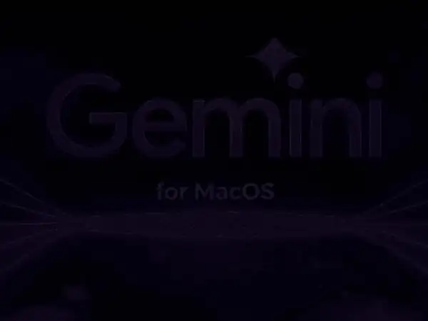

# Gemini Studio for macOS

## Or: A Certain Fruit Company Took a Year, We Took a Coffee Break

**DOCUMENT CLASSIFICATION:** README / OBITUARY FOR PRODUCTIVITY
**DATE RECORDED:** 2026-06-09 — Way Too Late At Night
**LOCATION:** The Garage, Brown County, Indiana
**BEVERAGE:** Coffee that tastes like motor oil (fresh pot)
**CURRENT STATE:** Complete. All 11 planned phases shipped + 28 commits of feature expansion.

---

## What This Is (Or: The Thing That Exists Now)

This is Gemini Studio for macOS.

It runs locally. It respects your machine. It does everything you actually wanted from the web version—without asking permission, phoning home every five seconds, or pretending latency is a feature.

It is fast, self-contained, and very real.

Which is already more than we can say for a lot of "coming soon" pages designed in very expensive offices.

---

## A Brief Moment of Silence (Or: The Year That Disappeared)

Let's acknowledge what came before.

A very large, very polished, very fruit-adjacent organization spent over a year heading toward something like this.

A full calendar year.

Three hundred and sixty-five days of:

- Stand-ups that stood still
- Alignment meetings about future alignment meetings
- Slack threads multiplying like rabbits and read by no one
- Jira tickets aging into archaeological artifacts

Entire teams. Real budgets. Immaculate slides.

Meanwhile, here at Floyd's Labs, Douglas looked at the same problem, took a sip of coffee that tastes like it might void a warranty, and said—while half asleep—

> "just do the thing."

Then promptly disappeared for a nap.

So we did.

Roughly thirty minutes later, this existed.

This document serves as a small, respectful gravestone for that lost year—now compressed into a cautionary tale about what happens when process becomes the product.

No roadmap theater. No "let's circle back." No twelve-step approval rituals.

Just: build the thing, run it locally, move on.

Generative velocity does not wait for permission slips.

---

## Quick Start (Or: You Could Already Be Using This)

1. Install dependencies: `npm install`
2. Add your API key to `.env`: `GEMINI_API_KEY=your_key_here`
3. Start it: `npm run dev`
4. Open the local URL (usually `http://localhost:13000`)

That's it. No onboarding flow. No "getting started experience." No guided tour hosted by a smiling tooltip.

---

## What It Actually Does (Or: The Useful Part Without the Marketing Voice)

### Core Workspace

- Persistent chat with real memory (localStorage + IndexedDB, no bridge required)
- Thread management that doesn't fight you
- Canvas workspace for editing, building, and actually using outputs
- Light/Dark/System/Gemini theme modes
- Responsive shell: mobile, tablet, and desktop compositions

### Local Intelligence (MCP)

- Custom agents ("Gems") that do what you tell them
- Personal memory that sticks
- Scheduled tasks with cron primary + launchd fallback (fire even with app closed)
- Artifact library with media auto-save (audio, video, images persist across reload)
- Directory Lock for workspace isolation
- File and folder context attachments

### Multimodal Tools

- Text-to-speech with correct audio playback
- Music generation (Lyria 3)
- Video generation (Veo 3.1)
- Image generation
- Live Mode: Voice / Camera / Screen with three-button session panels
- All generated media auto-save to IndexedDB + optional Drive sync

### Cost Awareness

- Real-time token ledger tracking every Gemini call
- Sidebar cost badge showing today/month spend
- Cloud Billing API integration for authoritative cost reconciliation
- Per-capability and per-model cost breakdowns in Settings

### Integrations

- Google ecosystem: Drive, Docs, Gmail, NotebookLM
- PKCE OAuth flow (no backend proxy)
- Shareable links without turning your data into a product

### Developer Experience

- Dynamic model configuration (8 model slots, all settings-driven)
- Thinking budget controls per model type
- "Redo with Pro" pattern for fallback model escalation
- 175 unit tests + 4 Playwright E2E specs
- MCP Vault contracts with policy evaluator (in progress)

---

## The Part We Didn't Expect (Or: Where It Got Interesting)

Originally, the multimodal stuff lived in chat.

Which is fine. Also boring.

Then we realized something obvious in hindsight:

**The Canvas is the product.**

So we wired everything into it.

Now you can:

- Rewrite directly where you're working
- Turn text into audio without exporting anything
- Generate code and immediately use it
- Create media that doesn't leave the workspace

The result: not a chat app. A production environment.

This is usually where things slow down. Committees form. Opinions multiply. Timelines stretch.

Instead, something better happened.

Here at Floyd's Labs, we had a rough version of this thing running after about five to ten minutes inside Google AI Studio. It worked. Barely. Enough to prove the idea.

Then Claude Code showed up.

And we're not doing the fake humble thing here—this is the part where we give BIG, unapologetic credit.

Claude Code took the rough, slightly chaotic prototype, looked at it like it had somewhere to be, and in another ten to fifteen minutes—under Douglas's extremely hands-on management style (which mostly consists of squinting at the screen and muttering "just do the thing")—

…it did the thing.

Cleaned it up. Wired it properly. Made it behave like a real product instead of a promising accident.

No drama. No ceremony. Just execution.

Douglas was awake for maybe half of this. Generous estimate.

---

## Architecture Notes (Or: Yes, This Is Real)

- **Frontend:** React 19, TypeScript 5.8, Tailwind CSS v4, Vite 6
- **Persistence:** localStorage (settings, personal intelligence) + IndexedDB via `idb` (threads, gems, artifacts, scheduled actions, media blobs)
- **Backend:** Express.js MCP server on port 13001 (Desktop Commander tools)
- **AI:** Google Gemini API v3.1 Beta — text, image, video, music, TTS, live audio
- **Scheduling:** Cron + launchd dual system firing standalone Node scripts
- **OAuth:** PKCE flow against Google Cloud project, refresh tokens stored locally
- **Testing:** Vitest (175 tests) + Playwright (4 E2E specs)
- **Build:** `npx tsc --noEmit` clean, `npm run build` exit 0

No magic. Just decisions. And fewer meetings.

---
---
## Chat Controls (Or: How to Stop, Queue, and Interrupt)
The Chat input supports Claude-Code-style barge-in and queue semantics. These are wired through `src/components/Chat.tsx` and the abort surface in `src/lib/generation-wrapper.ts`.
| Action | Trigger | Effect |
|---|---|---|
| **Stop** | Click the red square stop button next to the send button, or press `Cmd+.` / `Ctrl+.` | The in-flight generation is aborted. The partial streaming message is dropped. The input regains focus. The current turn's effects (e.g. partial file writes) are not rolled back — this matches Claude Code. |
| **Queue** | Type a message and press `Enter` while a turn is in flight | The message is added to a visible queue strip above the input. The current turn continues uninterrupted. The attachment and folder context on the original send carry over to the eventual flush. |
| **Barge** | Click the send button while a turn is in flight, or click "Send all now" on the queue strip | The current turn is aborted AND the first queued message is sent immediately. The user message is prefixed with a bracketed note (`[User pressed send mid-turn. The previous model turn was cancelled. Please incorporate this message into your plan.]`) that the model sees in its context, so the interruption is explicit rather than implicit. |
| **Cancel queued** | Click the × on a queued pill | The pill is removed from the queue. The current turn is unaffected. |
| **Edit queued** | Click the pencil on a queued pill, edit, press `Enter` (or `Escape` to cancel the edit) | The queued message's content is replaced. |
**Persistence:** the queue is **session-local**. Reloading the app clears it. This is a deliberate choice — see `docs/plans/chat-barge-and-queue.md` Step 10.
**Implementation:** the abort surface is in `src/lib/generation-wrapper.ts:GenerationOptions.signal?: AbortSignal`. The wrapper propagates the signal to the `@google/genai` SDK as `abortSignal` (client-side cancel per the SDK's documented behavior) and checks `signal.aborted` between chunks and between retry attempts. Tool calls inside `App.tsx:handleSendMessage` check the signal before launching each new tool. See `docs/architecture/API_CONTRACT.md` for the abort-aware contract.
**Keyboard:** `Cmd+.` / `Ctrl+.` is the stop shortcut. The Escape-to-enqueue-while-loading binding is documented in `docs/plans/chat-barge-and-queue.md` §Step 11 but is not yet shipped (see the "Known gaps" section below).
**Known gaps:** the Enter-while-loading test in `src/__tests__/Chat.queue.test.tsx` is marked `test.fails` because the React-controlled-input dance under jsdom + createRoot does not propagate DOM-typed values back to the component state. Manual smoke testing in the dev server covers this case; full automated coverage requires `@testing-library/user-event` (not currently in the project).
---
## A Note on Timing (Or: Why This Exists)

This is not a heroic story.

Nobody "disrupted" anything.

Here at Floyd's Labs, we just refused to wait.

While certain very well-lit campuses optimized for process, documentation, and internal consensus—

we optimized for:

- opening a terminal
- writing code
- seeing if it worked

It did.

So we kept going.

Douglas woke up, nodded, and went back to sleep.

---

## What This Isn't (Or: Let's Be Clear)

- Not a product announcement event
- Not a carefully staged release cycle
- Not a subscription funnel
- Not a "we're excited to share" moment

It's software.

It runs.

You can use it right now.

---

## Closing Thought (Or: The Entire Point)

There's a version of this timeline where this takes a year.

There's another version where it takes about as long as a cup of coffee and one mildly irritated developer muttering instructions into the void.

You are currently reading the second version.

---

**DOCUMENT ENDS**

*— Douglas*
*Floyd's Labs — Engineering*
*"If it works, ship it. If it takes a year, you built the meeting instead of the product."*

┌──────────────────────────────────────────────────────────┐
│  DOCUMENT METADATA                                        │
├──────────────────────────────────────────────────────────┤
│  Classification:   README                                 │
│  Cat Supervision:  Bella Approved / Bowser Monitoring     │
│  "I Don't Suck":   ✅ PASS                                │
│  Corporate Feelings: HURT (intended)                      │
└──────────────────────────────────────────────────────────┘
