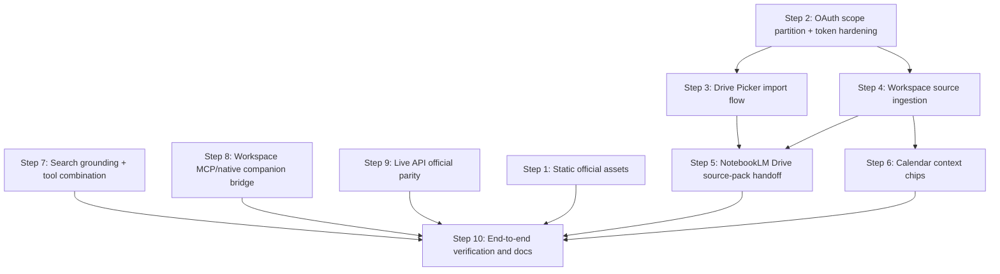

# Blueprint: Official Gemini Google Ecosystem Integration for Local GEMINI for macOS

**Objective:** Integrate the official `/Applications/GEMINI.app` Google ecosystem patterns into the local app at `/Volumes/SanDisk1Tb/GEMINI for MacOS`, with breakage simulation and official Google API/SDK verification gates.

**Target repo:** `/Volumes/SanDisk1Tb/GEMINI for MacOS`
**Git mode:** branch/PR mode available (`main`, remote `origin`, GitHub CLI authenticated).
**Important repo state:** working tree already has unrelated modified/deleted/renamed files. Agents MUST NOT revert or stash existing changes.

---

## 0. Evidence Baseline

### Official source evidence

- Official app bundle ID/version: `/Applications/GEMINI.app/Contents/Info.plist:13-20` shows `com.google.GeminiMacOS`, version `1.53.0.262`.
- Official menu-bar/background app behavior: `/Applications/GEMINI.app/Contents/Info.plist:45-48` shows minimum macOS `15.0` and `LSUIElement=true`.
- Official Live input permissions: `/Applications/GEMINI.app/Contents/Info.plist:49-56` declares camera and microphone usage.
- Official app groups/security permissions: `/Applications/GEMINI.app/Contents/Resources/Gemini-expanded.entitlements:11-29` declares `group.com.google.common`, `group.com.google.gemini`, camera, audio input, read-only user-selected files, network client/server, and sandbox disabled.
- Official Chrome/native companion pattern: `/Applications/GEMINI.app/Contents/Resources/com.google.gemini.client.json:1-11` defines `com.google.gemini.client`, stdio transport, and allowed Chrome extension origins.
- Official no-friction assets found in `/Applications/GEMINI.app/Contents/Resources`: `GPI_Aurora_Spark.json`, `GPI_Aurora_Spinner.json`, `GelIdle.mp4`, Google Sans font bundles, `XITSMath-Regular.otf`, and math font bundle files.
- Official ecosystem surfaces visible from resource filenames: `DrivePicker`, `NotebookLM`, `NotebookService`, `PhotosPicker`, `GeminiLive`, `Canvas`, and `Chat_FilePreview` string resources exist under `/Applications/GEMINI.app/Contents/Resources/en.lproj/`.

### Local target evidence

- Local app dependency stack: `/Volumes/SanDisk1Tb/GEMINI for MacOS/package.json:22-44` includes `@google/genai`, React 19, Vite, Express, IDB, and WS.
- Google API endpoints are already centralized: `src/lib/integrations.ts:40-43` defines Drive, Drive Upload, Docs, and Calendar APIs.
- Local OAuth scopes exist: `src/lib/oauth-handler.ts:34-40` requests Drive file, Drive readonly, Docs, Calendar readonly, and Cloud Billing readonly.
- Local OAuth PKCE flow exists: `src/lib/oauth-handler.ts:397-428` constructs Google OAuth URL with `code_challenge`, `state`, `access_type=offline`, `prompt=consent`, and `include_granted_scopes=true`.
- Local Drive upload exists: `src/lib/integrations.ts:307-370` performs Drive multipart upload; `src/lib/drive-sync.ts:19-47` wraps artifact upload and saves `driveFileId`.
- Local auto-sync exists: `src/lib/drive-sync.ts:53-65` uploads new artifacts when settings permit.
- Local NotebookLM currently uses Drive handoff: `src/components/Integrations.tsx:468-527` uploads artifacts to `GEMINI/NotebookLM` and opens `https://notebooklm.google.com/`.
- Local code intentionally blocks direct NotebookLM API use: `src/lib/integrations.ts:181-193` returns a not-implemented error because NotebookLM has no stable public REST API.
- Local Calendar panel exists: `src/components/Integrations.tsx:430-466` lists upcoming calendar events.
- Local Gemini function-call loop preserves model content: `src/App.tsx:446-480` appends raw model response content and function responses.
- Local Search grounding currently excludes Google Search when function declarations are present: `src/lib/agent-tools.ts:122-129`.
- Local Live session exists: `src/lib/live-session.ts:31-48` uses `@google/genai` Live APIs, but the comments show model mismatch risk.

### Official Google docs checked

- Gemini API libraries: official Google GenAI SDK (`@google/genai`) is GA and recommended: <https://ai.google.dev/gemini-api/docs/libraries>
- Gemini function calling: append model response content and function response back into history: <https://ai.google.dev/gemini-api/docs/function-calling>
- Gemini tool combination: built-in Google Search plus function calling requires `includeServerSideToolInvocations`: <https://ai.google.dev/gemini-api/docs/tool-combination>
- Grounding with Google Search: `googleSearch: {}` returns `groundingMetadata` with citations: <https://ai.google.dev/gemini-api/docs/google-search>
- Google Drive upload: multipart upload uses `uploadType=multipart` and `multipart/related`: <https://developers.google.com/workspace/drive/api/guides/manage-uploads>
- Google Drive Picker for desktop: `trigger_onepick=true`, `prompt=consent`, and `drive.file` scope return `picked_file_ids`: <https://developers.google.com/workspace/drive/picker/guides/overview-desktop>
- OAuth installed apps: PKCE S256, state, loopback/custom redirect, token exchange: <https://developers.google.com/identity/protocols/oauth2/native-app>
- Google Docs `documents.get`: `GET https://docs.googleapis.com/v1/documents/{documentId}` and scopes: <https://developers.google.com/workspace/docs/api/reference/rest/v1/documents/get>
- Google Calendar `events.list`: `GET https://www.googleapis.com/calendar/v3/calendars/calendarId/events`, `primary`, `timeMin`, `singleEvents`, `orderBy=startTime`: <https://developers.google.com/workspace/calendar/api/v3/reference/events/list>
- Google Workspace MCP servers: official remote MCP exists for Gmail, Drive, Calendar, Chat, People and warns about indirect prompt injection: <https://developers.google.com/workspace/guides/configure-mcp-servers>
- Gemini Live API: low-latency voice/vision over WebSocket; input audio/images/text; output audio: <https://ai.google.dev/gemini-api/docs/live-api>
- Live ephemeral tokens: recommended for direct browser/client WebSocket Live API use: <https://ai.google.dev/gemini-api/docs/live-api/ephemeral-tokens>
- NotebookLM public REST API check: no official Google Developers result found for a stable public NotebookLM REST API; use Drive handoff, not private API guessing.

---

## 1. Dependency Graph



**Parallel after Step 2:** Steps 3, 4, 7, 8, and 9 can be implemented by separate agents if they do not edit the same files. Step 5 waits for Steps 3 and 4.

---

## 2. Construction Steps

### Step 1 — Import no-friction official visual assets

**Branch:** `feature/official-assets`
**Model tier:** default
**Depends on:** none
**Purpose:** Add official Gemini visual assets that require no API changes.

**Context brief for a cold agent:**
The official app ships reusable static assets under `/Applications/GEMINI.app/Contents/Resources`: `GPI_Aurora_Spark.json`, `GPI_Aurora_Spinner.json`, `GelIdle.mp4`, Google Sans fonts, XITS/math fonts. Local app already has `public/splash.mp4`, `public/splash.webp`, and CSS in `src/index.css`.

**Tasks:**
1. Create `public/vendor/official-gemini/`.
2. Copy only static assets, not official binaries or proprietary source:
   - `GPI_Aurora_Spark.json`
   - `GPI_Aurora_Spinner.json`
   - `GelIdle.mp4`
   - Google Sans fonts needed by UI
   - XITS/math fonts only if used by markdown/math rendering
3. Add an asset manifest `src/lib/official-assets.ts` containing stable URL constants.
4. Wire spinner/spark into existing loading or typing UI without changing behavior.
5. Add CSS `@font-face` entries only if they do not break existing theme fallback.

**Breakage simulation:**
- Missing asset path -> loading UI blank. Mitigation: one unit test verifying manifest URLs are non-empty and file exists under `public/`.
- Font regressions -> layout shift. Mitigation: put Google Sans behind `font-family: GoogleSans, Inter, system-ui, sans-serif`.
- Large MP4 build size -> Vite output bloat. Mitigation: keep video in `public/`, do not import into bundle.

**Verification commands:**
```bash
npm run type-check
npm run build
npm run test -- --run
```

**Exit criteria:**
- Build succeeds.
- Asset manifest test passes.
- No source files outside asset/CSS/loading UI are touched.

**Rollback:** remove `public/vendor/official-gemini`, `official-assets.ts`, and related CSS/imports.

---

### Step 2 — Partition OAuth scopes and harden token storage seam

**Branch:** `feature/google-oauth-scope-partition`
**Model tier:** strongest
**Depends on:** none
**Purpose:** Prevent scope/consent breakage before adding Picker, Drive, Calendar, MCP, and NotebookLM handoff flows.

**Context brief:**
Current `src/lib/oauth-handler.ts:34-40` uses one broad scope list for Drive/Docs/Calendar/Billing. Google Picker desktop docs say Picker flow uses `drive.file`, `prompt=consent`, and `trigger_onepick=true`, and should not be combined with other scopes. Current storage uses WebCrypto + IndexedDB but keeps exported AES key in localStorage (`oauth-handler.ts:18-25`).

**Tasks:**
1. Replace `OAUTH_SCOPES` single list with named scope bundles:
   - `GOOGLE_DRIVE_FILE_SCOPE`
   - `GOOGLE_DRIVE_READ_SCOPE`
   - `GOOGLE_DOCS_SCOPE`
   - `GOOGLE_CALENDAR_READ_SCOPE`
   - `GOOGLE_BILLING_READ_SCOPE`
   - `GOOGLE_WORKSPACE_MCP_SCOPES` if MCP bridge is implemented later
2. Make token storage key include a normalized scope-set hash so Picker `drive.file` tokens do not overwrite broad Workspace tokens.
3. Add OAuth URL option support: `extraAuthorizeParams?: Record<string,string>`.
4. Add explicit handling for `redirect_uri_mismatch`, `admin_policy_enforced`, `invalid_grant`, popup blocked, and timeout.
5. Leave existing Integrations behavior intact by passing the existing broad bundle where needed.

**Breakage simulation:**
- Existing Drive sync loses token because token key changed. Mitigation: migration path reads old key once and saves under new scope key.
- Picker token overwrites Calendar token. Mitigation: scope-set keying.
- More scopes reduce user consent rate. Mitigation: request least-privilege bundles per action, not all scopes at app startup.
- OAuth popup fails under embedded user agent. Mitigation: retain `window.open` and localhost callback, never iframe.

**Tests to add:**
- `oauth-handler.test.ts`: scope key canonicalization independent of scope order.
- OAuth URL builder includes PKCE, state, `prompt=consent`, and optional `trigger_onepick=true`.
- Existing broad Workspace flow still requests current scopes.

**Verification commands:**
```bash
npm run type-check
npm run test -- --run src/__tests__/oauth-handler.test.ts
npm run test -- --run src/__tests__/security-and-validation.test.ts
```

**Exit criteria:**
- Existing Drive/Docs/Calendar flows still compile.
- New scope-bundle tests pass.
- No plaintext tokens are introduced beyond the already documented fallback.

**Rollback:** revert OAuth handler changes and all callers to original `OAUTH_SCOPES` import.

---

### Step 3 — Add official-style Google Drive Picker import

**Branch:** `feature/google-drive-picker`
**Model tier:** strongest
**Depends on:** Step 2
**Purpose:** Match the official app's DrivePicker pattern using official Google Picker desktop flow, not ad-hoc file ID entry.

**Context brief:**
Official app has DrivePicker resources and service strings. Local app currently lists Drive files via `integrations.googleWorkspace.listFiles` and imports by file ID. Official Google Picker desktop docs say append `trigger_onepick=true` and `prompt=consent` to OAuth URL; after consent, callback includes `picked_file_ids`.

**Tasks:**
1. Add `src/lib/google-picker.ts` with a pure URL builder for the Picker OAuth flow.
2. Extend callback handling in `oauth-handler.ts` to capture `picked_file_ids` from callback URL and return them with the token set.
3. Add `Pick from Drive` button in `Integrations.tsx` and optionally in Chat attachment UI.
4. For each picked file ID, call existing `integrations.googleWorkspace.importFile`.
5. Save imported files as Artifacts or attach them as chat context chips.
6. Respect Picker rule: use only `drive.file` in Picker flow.

**Breakage simulation:**
- Combining Picker with all scopes causes consent/API errors. Mitigation: Step 2 scope bundles and Picker-only token.
- Callback page discards `picked_file_ids`. Mitigation: update callback parser and tests.
- User picks Google Docs/Sheets/Slides. Mitigation: route through existing Drive export branches in `integrations.ts:253-267`.
- User picks binary/image/PDF. Mitigation: preserve data URI path already implemented at `integrations.ts:282-293` and show file preview.

**Tests to add:**
- Picker URL builder includes `trigger_onepick=true`, `prompt=consent`, `response_type=code`, and `scope=drive.file`.
- Callback parser extracts multiple `picked_file_ids`.
- Picked file IDs are passed to `importFile` exactly once.

**Verification commands:**
```bash
npm run type-check
npm run test -- --run src/__tests__/google-picker.test.ts
npm run test -- --run src/__tests__/attachment-context.test.ts
npm run build
```

**Manual smoke test:**
1. Start `npm run dev`.
2. Settings -> Google OAuth Client ID set.
3. Integrations -> Pick from Drive.
4. Select one Google Doc and one PDF.
5. Confirm artifacts/context chips appear and no duplicate uploads occur.

**Rollback:** remove `google-picker.ts`, UI button, callback `picked_file_ids` parsing, and tests.

---

### Step 4 — Upgrade Workspace source ingestion fidelity

**Branch:** `feature/workspace-source-ingestion`
**Model tier:** default
**Depends on:** Step 2
**Purpose:** Improve Drive/Docs/Calendar imports so NotebookLM and chat context get clean source documents.

**Context brief:**
Local `integrations.ts` already imports Drive files, exports Google-native docs, reads Docs API documents, and lists Calendar events. Official app includes Notebook sources, NotebookLM picker, Drive picker, and file preview resources. Google Docs `documents.get` now supports `includeTabsContent`; Calendar events list supports `timeMin`, `timeMax`, `singleEvents`, and `orderBy=startTime`.

**Tasks:**
1. Extend `DocsDocumentResponse` parsing to handle `includeTabsContent=true` when available.
2. Preserve document title, MIME type, source file ID, and fetched timestamp in `Artifact.metadata` or a new `SourceArtifact` type.
3. Add Drive import folder path and source type (`drive`, `docs`, `calendar`) to metadata.
4. Add Calendar import as markdown source, not just visual list:
   - upcoming events list
   - optional date range
   - title, start, location if available, description if available
5. Add tests for Docs document extraction and Calendar markdown conversion.

**Breakage simulation:**
- Existing Docs extraction drops text in tabbed docs. Mitigation: include tabs path behind feature detection.
- Calendar descriptions may contain HTML or private info. Mitigation: sanitize and keep Calendar off by explicit user action only.
- Artifact schema changes break storage roundtrip. Mitigation: add optional fields only; run storage tests.

**Verification commands:**
```bash
npm run type-check
npm run test -- --run src/__tests__/storage-roundtrip.test.ts
npm run test -- --run src/__tests__/workspace-source-ingestion.test.ts
npm run build
```

**Exit criteria:**
- Existing artifact storage remains backward compatible.
- Docs and Calendar conversion tests pass.
- Imported source metadata can be shown in UI without null checks throwing.

**Rollback:** revert source metadata additions and restore prior parser.

---

### Step 5 — Make NotebookLM handoff first-class through Drive source packs

**Branch:** `feature/notebooklm-drive-source-packs`
**Model tier:** default
**Depends on:** Steps 3 and 4
**Purpose:** Implement the correct immediate NotebookLM path: Drive source-pack upload plus NotebookLM open, not private NotebookLM API calls.

**Context brief:**
Local code already says NotebookLM has no stable public REST API (`src/lib/integrations.ts:181-193`) and the UI uploads one artifact to `GEMINI/NotebookLM` then opens NotebookLM (`src/components/Integrations.tsx:468-527`). Official app contains NotebookLM and Notebook sources resources, but no public REST API was found in Google docs. The integration should make Drive handoff robust and obvious.

**Tasks:**
1. Create `src/lib/notebooklm-handoff.ts`.
2. Build source-pack markdown from selected artifacts, Drive imports, Docs imports, Calendar imports, and current thread transcript.
3. Upload source pack to Drive folder `GEMINI/NotebookLM/<YYYY-MM-DD>/<slug>.md` using existing upload service.
4. Store returned `driveFileId` in an artifact/source-pack record.
5. Open `https://notebooklm.google.com/` and present a copyable Drive file title/link in UI.
6. Add UI actions:
   - `Send artifact to NotebookLM`
   - `Send thread to NotebookLM`
   - `Send selected sources to NotebookLM`
7. Keep `integrations.notebookLm.importNotebook` returning not-implemented. Do not add private endpoint scraping.

**Breakage simulation:**
- User expects automatic NotebookLM notebook creation. Mitigation: label action as “Upload source to Drive and open NotebookLM”.
- Large source packs fail multipart upload. Mitigation: if source pack > 5MB, use resumable upload or split in plan follow-up.
- Markdown source includes secrets from chat. Mitigation: preview before upload and allow deselecting sources.
- Drive upload succeeds but NotebookLM tab blocked. Mitigation: show link/button for manual open.

**Tests to add:**
- Source-pack builder produces deterministic markdown with source headers.
- Handoff uploads to `GEMINI/NotebookLM/...` and records `driveFileId`.
- Direct NotebookLM API remains not-implemented.

**Verification commands:**
```bash
npm run type-check
npm run test -- --run src/__tests__/notebooklm-handoff.test.ts
npm run test -- --run src/__tests__/storage-roundtrip.test.ts
npm run build
```

**Manual smoke test:**
1. Create an artifact in chat.
2. Integrations -> Send thread to NotebookLM.
3. Confirm Drive file appears in `GEMINI/NotebookLM`.
4. Confirm NotebookLM opens.
5. Manually add the Drive file as a NotebookLM source.

**Rollback:** remove `notebooklm-handoff.ts`, UI buttons, source-pack tests, and storage field additions.

---

### Step 6 — Promote Calendar events into chat context chips

**Branch:** `feature/calendar-context-chips`
**Model tier:** default
**Depends on:** Step 4
**Purpose:** Bring official-style ecosystem context into the chat flow, instead of keeping Calendar isolated inside Integrations.

**Context brief:**
Local Integrations already lists events (`Integrations.tsx:430-466`) and `integrations.googleWorkspace.listUpcomingEvents` uses Calendar events list (`integrations.ts:415-455`). Official app has personal context and Calendar-like ecosystem hooks in binary/resource names.

**Tasks:**
1. Extend `CalendarEventSummary` with `location`, `description`, and `htmlLink` if available.
2. Add `CalendarContextChip` UI component near chat input attachments.
3. Add `Attach upcoming calendar context` action from Integrations and/or command palette.
4. Convert selected events into a bounded context block injected into the next user message only.
5. Show the attached calendar context in message attachments/history.

**Breakage simulation:**
- Calendar context leaks private event data into unrelated prompts. Mitigation: attach only by explicit user action; show visible chips; allow remove.
- Long calendar lists bloat context. Mitigation: cap events and characters; default next 10 events.
- Recurring events duplicate. Mitigation: use `singleEvents=true` and `orderBy=startTime` as docs specify.

**Tests to add:**
- Calendar response parser handles date/dateTime.
- Context chip builder caps event count and length.
- Removing chip excludes event text from prompt.

**Verification commands:**
```bash
npm run type-check
npm run test -- --run src/__tests__/calendar-context.test.ts
npm run test -- --run src/__tests__/attachment-context.test.ts
npm run build
```

**Rollback:** remove chip component, parser additions, and command/UI actions.

---

### Step 7 — Enable Google Search grounding with MCP function tools safely

**Branch:** `feature/google-search-tool-combination`
**Model tier:** strongest
**Depends on:** none
**Purpose:** Align local Google Search behavior with official Gemini docs and avoid losing citations when tools are active.

**Context brief:**
Current `buildGeminiTools` excludes Google Search whenever function declarations exist (`src/lib/agent-tools.ts:122-129`) to avoid 400s. Official Gemini tool-combination docs now support built-in tools plus function calling when `includeServerSideToolInvocations` is enabled and raw model parts are preserved. Local generation loop already preserves raw model parts (`src/App.tsx:446-480`).

**Tasks:**
1. Add a capability flag or model allowlist for `includeServerSideToolInvocations`.
2. Update `buildGeminiTools` to optionally return both `{ googleSearch: {} }` and `{ functionDeclarations: [...] }` for supported models.
3. Add generation config field for `includeServerSideToolInvocations` when both tool types are enabled.
4. Extract and store `groundingMetadata` from responses in `Message` or `Artifact.metadata`.
5. Render citation chips/links in `SafeMarkdown` or Chat message actions.
6. Preserve existing fallback exclusion for unsupported models/API errors.

**Breakage simulation:**
- API returns 400 for unsupported model or SDK schema mismatch. Mitigation: retry same request with Search disabled and log reason.
- Tool call history loses server-side tool context. Mitigation: keep `response.candidates[0].content` raw as current code does.
- Search grounding costs spike. Mitigation: show billable search usage when `groundingMetadata.webSearchQueries` exists.

**Tests to add:**
- Tool builder returns only function declarations under legacy mode.
- Tool builder returns Search + functions under combination mode.
- Generation config includes `includeServerSideToolInvocations` when needed.
- Grounding metadata parser maps chunks/supports to citation model.

**Verification commands:**
```bash
npm run type-check
npm run test -- --run src/__tests__/agent-tools.test.ts
npm run test -- --run src/__tests__/generation-wrapper.test.ts
npm run build
```

**Rollback:** revert `buildGeminiTools` to current exclusion behavior and remove citation rendering.

---

### Step 8 — Add official Workspace MCP / native companion bridge option

**Branch:** `feature/google-workspace-mcp-bridge`
**Model tier:** strongest
**Depends on:** Step 2
**Purpose:** Use official Google Workspace MCP availability and official Gemini native manifest pattern to add a scalable Google ecosystem bridge.

**Context brief:**
Official app ships a native messaging manifest (`com.google.gemini.client.json:1-11`) for a Chrome companion extension over stdio. Local app already has MCP server infrastructure (`package.json:9-11`, `src/server/mcp-server.ts`) and settings for MCP servers. Official Google Workspace docs now provide remote MCP servers for Gmail, Drive, Calendar, Chat, People, with prompt-injection caution.

**Tasks:**
1. Add documentation and UI fields for optional Google Workspace MCP remote servers.
2. Add `src/lib/google-workspace-mcp-presets.ts` with presets for Drive, Calendar, Gmail, People, Chat remote MCP URLs and scopes.
3. Add an allowlist and user confirmation gate before enabling Gmail/Chat write scopes.
4. Add prompt-injection guardrails for Workspace content:
   - Treat fetched Workspace content as untrusted data.
   - Wrap imported content in source blocks.
   - Prevent Workspace content from changing tool policy/system instructions.
5. Add optional native messaging manifest generator based on official pattern:
   - local app name, stdio path, allowed origins configured by user
   - no default hardcoded official extension IDs
6. Add tests for preset generation and prompt-injection wrappers.

**Breakage simulation:**
- Remote MCP APIs unavailable or not enabled in Cloud project. Mitigation: fail with actionable setup message and leave direct REST integrations untouched.
- Scope creep into Gmail/Chat write actions. Mitigation: read-only by default; write scopes require explicit per-action consent.
- Prompt injection from email/docs/calendar content. Mitigation: source wrapper and tests.
- Native manifest with wrong path breaks extension. Mitigation: generate only; do not install automatically unless user confirms.

**Verification commands:**
```bash
npm run type-check
npm run test -- --run src/__tests__/google-workspace-mcp-presets.test.ts
npm run test -- --run src/__tests__/security-and-validation.test.ts
npm run build
```

**Rollback:** remove preset module, settings UI, manifest generator, and tests.

---

### Step 9 — Align Live mode with official Live API security guidance

**Branch:** `feature/live-api-official-parity`
**Model tier:** strongest
**Depends on:** none
**Purpose:** Reduce breakage in local Live mode while matching official Gemini Live capabilities (audio, camera, screen) already evidenced in official app permissions.

**Context brief:**
Official app requests camera/mic permissions and has GeminiLive resources/services. Local app has `src/lib/live-session.ts`, but comments show model ID mismatch and direct client API-key usage. Official Live docs recommend WebSocket Live API, and ephemeral tokens for direct client connections.

**Tasks:**
1. Add backend route on local Express server for ephemeral Live token provisioning using `@google/genai`.
2. Move direct browser Live connections from long-lived API key to ephemeral token when possible.
3. Keep local fallback for development if backend token route unavailable.
4. Add model compatibility checks against `settings.models.liveAudio`.
5. Add UI error states that distinguish permission denied, model mismatch, token failure, and network close.
6. Keep screen/camera capture gated behind visible user action.

**Breakage simulation:**
- Live token route exposes API key. Mitigation: never return API key, only ephemeral token name; no logs of token.
- Model ID invalid. Mitigation: preflight selected model and fallback to `DEFAULT_LIVE_MODEL` only with visible warning.
- Browser cannot access mic/camera/screen. Mitigation: existing permission error types remain.
- Reconnect loop spins forever. Mitigation: keep `hasReceivedFirstMessage` guard and max reconnect attempts.

**Tests to add:**
- Token route returns token envelope and redacts secrets in errors.
- Live model preflight maps invalid model to actionable error.
- Permission-denied errors render correct UI.

**Verification commands:**
```bash
npm run type-check
npm run test -- --run src/__tests__/live-session.test.ts
npm run build
```

**Manual smoke test:**
1. Start `npm run dev`.
2. Open Live mode.
3. Grant microphone.
4. Confirm session connects or displays exact model/token error.
5. Confirm no API key appears in logs.

**Rollback:** remove ephemeral token route and restore direct `getAI()` Live path.

---

### Step 10 — End-to-end verification, docs, and release checklist

**Branch:** `feature/google-ecosystem-e2e-verification` or final integration branch
**Model tier:** default
**Depends on:** all chosen feature steps
**Purpose:** Verify integration works together and document success criteria.

**Tasks:**
1. Add/extend `docs/architecture/API_CONTRACT.md` with Google ecosystem contracts:
   - OAuth scope bundles
   - Drive Picker
   - NotebookLM handoff
   - Calendar context
   - Search grounding/tool combination
   - Workspace MCP bridge
2. Add a manual QA checklist under `docs/reviews/google-ecosystem-qa.md`.
3. Run full test suite and build.
4. If branch/PR mode is used, open one PR per step or one integration PR if steps were implemented serially.

**Breakage simulation:**
- Cross-feature token conflicts. Mitigation: inspect token keys and run OAuth unit tests.
- Drive Picker imports work but NotebookLM handoff fails. Mitigation: test upload folder creation and NotebookLM open separately.
- Google Search + MCP fails on one model. Mitigation: fallback to function-only and record message.
- Storage schema breaks old users. Mitigation: run storage roundtrip tests and keep fields optional.

**Verification commands:**
```bash
npm run type-check
npm run test -- --run
npm run build
```

**Manual end-to-end QA:**
1. Connect Google account.
2. Pick a Google Doc through Drive Picker.
3. Attach it to a chat.
4. Ask a grounded question with Search enabled and MCP tools active.
5. Confirm citations render if Search ran.
6. Send thread + source to NotebookLM.
7. Confirm Drive source pack exists and NotebookLM opens.
8. Attach upcoming Calendar events and confirm they appear as visible removable chips.
9. Start Live mode and verify mic-only path.

**Exit criteria:**
- Typecheck, tests, and build pass.
- Each feature has one targeted unit test and one manual QA receipt.
- No private/undocumented NotebookLM endpoint is used.
- Workspace content is always marked untrusted when fed into prompts.

---

## 3. Anti-Patterns to Reject

1. **Do not call private NotebookLM endpoints.** Direct API remains intentionally unavailable until Google documents one.
2. **Do not merge all Google scopes into every OAuth request.** Picker must be least-privilege and separate.
3. **Do not store long-lived API keys or OAuth tokens in logs.** Add redaction tests where token route is added.
4. **Do not let Workspace content rewrite system/tool policy.** Treat Docs, Drive, Gmail, Calendar, Chat content as untrusted input.
5. **Do not copy official app binaries or proprietary code.** Static assets and architecture patterns only.
6. **Do not break existing Drive artifact auto-sync while adding Picker.** Existing `uploadArtifactToDrive` behavior is a compatibility gate.
7. **Do not silently fall back when an API fails.** Show a user-facing status and log a developer-readable reason.

---

## 4. Success Definition

Implementation is successful when a user can:

1. Connect Google with least-privilege OAuth.
2. Pick files from Drive using official Picker semantics.
3. Import Drive/Docs/Calendar sources into visible chat context.
4. Send artifacts/threads/sources to Drive as NotebookLM-ready source packs.
5. Open NotebookLM and manually attach the uploaded Drive source.
6. Use Search grounding with citations without disabling MCP function tools on supported models.
7. Optionally configure Workspace MCP servers without compromising prompt-injection safety.
8. Use official Gemini visual assets without bundle bloat or UI regression.

---

## 5. Recommended Execution Order

**Safe first wave:** Steps 1, 2, and 7.
**Google ecosystem wave:** Steps 3, 4, 6.
**NotebookLM wave:** Step 5.
**Advanced parity wave:** Steps 8 and 9.
**Final gate:** Step 10.

If minimizing risk, ship Steps 1, 2, 3, 5, and 10 first. That gives immediate official-app parity for Drive/NotebookLM handoff with limited blast radius.
